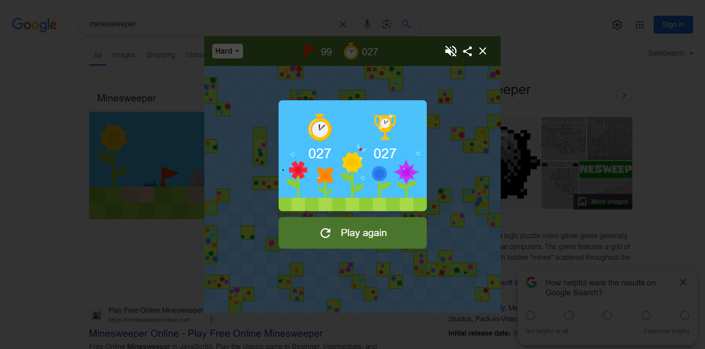

# Minesweeperer
Automate playing minesweeper on Google



## Usage

Disclaimer: Running these are on the premise that you have installed chrome driver. This can be especially troublesome on linux. You can refer to [Puppeteer's official website](https://pptr.dev/) for more information.

1. Make sure that you have `npm` version at least 10 and `node` version at least `20`. Verify the versions on your computer with the following commands.

Verify `npm` version:

```bash
npm --version
```

Verify `node` version:

```bash
node --version
```

2. Clone this repository.

```bash
git clone https://github.com/nknguyenhc/Minesweeperer.git
```

3. Redirect to the folder containing the cloned repository.

```bash
cd Minesweeperer
```

4. Install dependencies.

```bash
npm i
```

5. Run the script and enjoy.

```bash
npm start
```

You can change the script config in [`src/appconfig.ts`](./src/appconfig.ts) to your liking. Most importantly, you can change the difficulty level of the minesweeper game that the script plays.

## Concepts

There are two parts to this problem:

1. Interacting with browser.
2. Algorithm

### Interacting with browser

We simply use puppeteer to visit the google page, and pressing buttons to set up the game.

On google minesweeper page, the mine field itself is a canvas. To press opening a cell, we use puppeteer API to press the page at an exact location within the page. The cell positions are therefore calculated to facilitate opening cells.

To read number from a cell, notice that each number has a specific color shade. We therefore obtain the color shade and compare with reference colors to determine the number within a cell.

### Algorithm

This is a classical problem of knowledge representation. "Knowledge" is essentially a collection of sentences, where each sentence indicates a piece of information. Sentences can be combined to form new sentences. Sentences can also be used to determine where the mines and safe cells are. In this problem, we use forward chaining to deduce cells with mines and safe cells at each iteration.

Each sentence indicates the minimum and the maximum number of mines within a group of cells. Therefore, each sentence contains the following information:

* `cells`: The set of cells that the sentence points to.
* `lower`: The minimum total number of mines in the cells.
* `upper`: The maximum total number of mines in the cells.

For each two sentences, at most 3 other sentences can be inferred:

1. Sentence with cells that are in sentence 1 but not in sentence 2.
2. Sentence with cells that are in sentence 2 but not in sentence 1.
3. Sentence with cells that are both in sentence 1 and sentence 2.

In some cases, new sentences are redundant and hence they are not generated. For example, if two sentences are on cells that do not have any cell in common, there are no useful new sentences to be deduced. For another example, if cells in sentence 1 is a superset of cells in sentence 2, then only the new sentence of type (1) is useful.

Sentences can be used to infer mines or safe cells in the following cases:

* If `lower` is equal to the number of cells, then the sentence indicates that all involved cells are mines.
* If `upper` is equal to `0`, then the sentence indicates that all involved cells are safe cells.

The main routine does the following in each iteration:

1. Update the agent with the observed board.
2. Obtain the cells that can be opened.
3. Open the cells.

It repeats until the board is solved.

Upon receiving the observed board, the agent does the following:

1. Clean the knowledge base. This means removing sentences that are no longer necessary, and update the sentences if there are cells in the sentences opened.
2. Create new sentences, based on the new cells opened.
3. Does a forward chaining loop.
4. Returns the set of cells that can be opened.

One iteration of the forward chaining loop is as follows:

1. Add the new sentences to the knowledge base.
2. For each pair of sentences in the knowledge base, derive new sentences.
3. Return those new sentences as sentences to be added in step (1) in the next iteration.

Forward chaining repeats until one of the following conditions is true:

1. No new sentences are added, and no new cells are found to be safe or mine.
2. Time is out.

The timeout condition ensures that the agent does not spend too much time discover every possible safe cell. This ensures the efficiency of the programme.

## Known issues

There are some known issues that happen sporadically.

1. Script crashes at the start.

This is because of inconsistencies in the google page. You can simply run the script again. This problem should only occur once in a while.

2. Detection of numbers.

On the google minesweeper page, it animates for a short period of time when a cell is uncovered. This means that detection of numbers in some cells might be inconsistent. The decision to set wait time after opening cells of 800 is made to balance between the accuracy of cell reading and the runtime.

Furthermore, my tests have never encountered number 7. I cannot know for sure if the script can detect number 7 correctly. In any case that the script fails, you can always run again.
